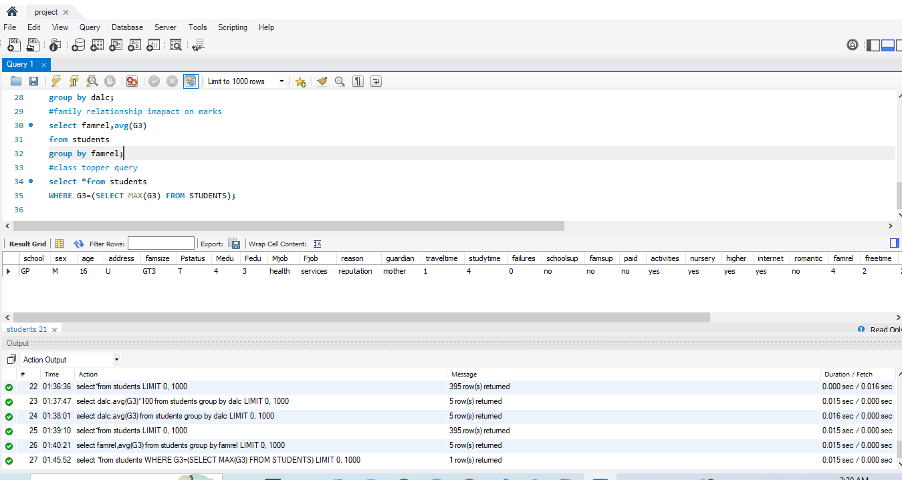

# 🎓 Student Performance Analysis

## 📌 Project Overview
This project analyzes student performance using Python (Pandas) and MySQL.

## 🛠 Technologies Used
- Python
- Pandas
- MySQL
- SQLAlchemy
- Jupyter Notebook

## 📊 Key Analysis
- Average performance
- Gender-wise performance
- Study time impact
- Social activity impact
- Alcohol consumption impact
- Family relationship impact

## 📈 Key Insights
- More study time improves performance
- Excessive social activity may reduce marks
- Alcohol consumption negatively affects performance
- Good family relationships improve results
- ## 📸 Project Output

## 👩‍💻 Author
Rohini Gavali
